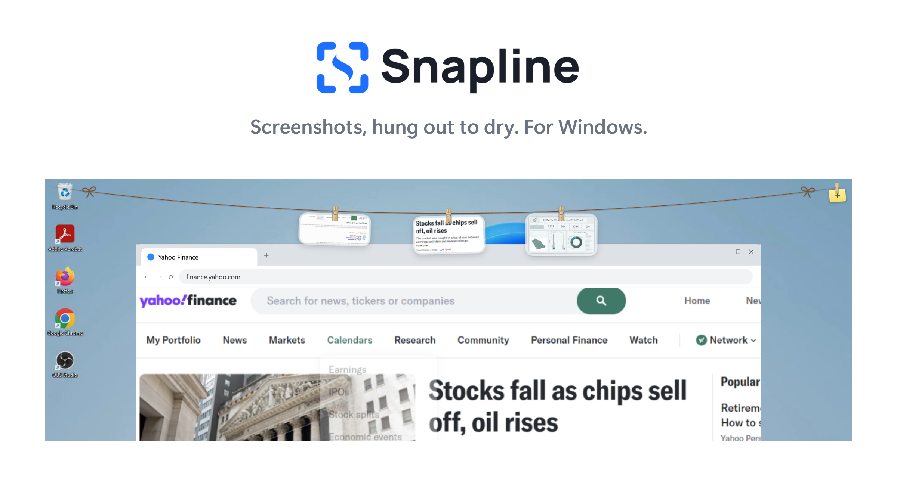
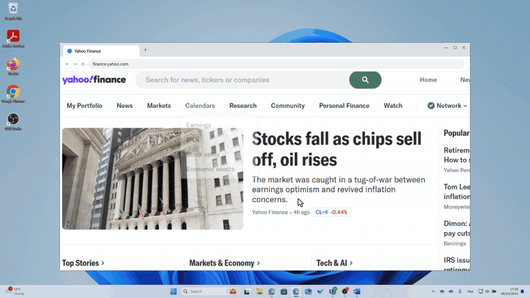

<p align="center">
  
</p>

<h1 align="center">Snapline</h1>

<p align="center">
  Screenshots, hung out to dry. For Windows 10 and 11.
  <br>
  A native port of <a href="https://github.com/alejandrobujan/tendedero">Tendedero</a> for macOS.
</p>

<br>

<picture>
  <source media="(prefers-color-scheme: dark)" srcset="docs/hero-dark.png">
  
</picture>

<br>

<p align="center">
  
</p>

<br>

## Out of sight. Within reach.

Every screenshot you take hangs on a line just above your screen.
Push the pointer against the top edge and it glides down. Move away and it's gone.

Each capture lifts off from where you took it and flies to the line. Cards swing when
they land, sway in an occasional breeze, and fall off the screen when you let them go.

<br>

## A gesture for everything.

| | |
|:--|:--|
| Click | Copy the image. Paste it anywhere, as a picture or as a file. |
| Press and hold, or click the pen in its corner | Mark it up: the photo opens enlarged with a ballpoint pen, a highlighter, circle, box, arrow and text tools, a blur for hiding names and numbers, six colours and three thicknesses. Every mark saves into the file as you go, with undo and redo, and *Revert to original* if you change your mind. *Edit in Paint* is in the right-click menu for anything more. |
| Click the little yellow tag at the end of the line, or right-click the line | The same menu as the tray icon: new capture, new note, settings. |
| *New note* in the menu | A sticky note hangs on the line, in yellow, pink, blue, green or orange. Write on it, and it swings, copies and drags out like any photo. Double click it to write again. |
| Double click | Open it in Photos. |
| Drag along the line | Put the photo where you want it. It stays there. With *Arrange photos evenly* on, the others make room instead. |
| Drag the line itself | Move the whole line up or down the screen, below your tabs if you like. |
| Drag into an app | Send a copy. It stays on the line. |
| Drag into a folder | Keep it there. It leaves the line. |
| Drag to the Recycle Bin, or click the cross | Let it go. |
| Right click | Copy, copy the text in it, open, edit, show in Explorer, keep, save, discard. |
| Hover | A small tooltip: file name, size, and how long it has been hanging. |
| Rest the pointer still at the top edge | Bring the line down on that screen, after half a second. A click up there means you are working, and the line stays away. If your taskbar is at the top, rest the pointer on it. |
| Click through the line | Any click into the window underneath tucks the line away at once. |
| <kbd>Ctrl</kbd>&thinsp;<kbd>Alt</kbd>&thinsp;<kbd>T</kbd> | Show or hide the line. Clicking the tray icon does the same. |

<br>

## Every capture, not just the saved ones.

Snapline watches `Pictures\Screenshots`, where <kbd>Win</kbd>&thinsp;<kbd>PrtScn</kbd> and the
Snipping Tool save their files. It also catches captures that only reach the clipboard:
<kbd>Win</kbd>&thinsp;<kbd>Shift</kbd>&thinsp;<kbd>S</kbd> with automatic saving turned off,
<kbd>PrtScn</kbd>, <kbd>Alt</kbd>&thinsp;<kbd>PrtScn</kbd>. Those are written to Snapline's own
folder and hang like any other. Only a pure image is caught: copying a picture out of a web
page or a document, which brings text along, is left alone.

Caught captures are the only files Snapline ever deletes. Discard one and it goes to the
Recycle Bin. Drag it to a folder, or choose *Save to Desktop*, to keep it. Screenshots from
`Pictures\Screenshots` or anywhere else stay where they are; taking one down only takes it
off the line.

Using ShareX, Greenshot or something else? Add its folder to `watchFolders` in the settings file.

<br>

## Read the words off a screenshot.

*Copy text* in the right-click menu reads whatever is written in the capture with the OCR built into
Windows and puts it on the clipboard. An error message, a code, an address in a video call: no
retyping. Nothing leaves your PC; it is the same engine the Snipping Tool uses, in the languages
you have installed.

<br>

## Keep the ones that matter.

The line holds as many photos as fit across your screen, and the oldest falls off the far end
when a new one arrives. *Keep on the line* gives a photo a brass clip and a permanent place:
newer captures never push it off.

Empty line? Click the hint, or *New capture* in the tray menu, and the Windows snipping overlay
comes up. The snip hangs the moment you let go.

<br>

## Your line, your way.

A bronze cord with a bow at each end and wooden pegs with real springs, by default. In
Settings you can pick another colour for the line, aluminium or coloured plastic pegs, light or
dark or whatever Windows uses, and English or Arabic, laid out right to left.

## Settings, from the tray menu.

Pick the shortcut by pressing it. Decide whether the top edge brings the line down at all, and
how far from the top it hangs. Add the folders your other tools save to. Choose where caught
captures go. Turn the options below on or off. Changes apply right away.

| | |
|:--|:--|
| **Stay down until each capture is used** | The line waits while a capture has not been copied, dragged or opened yet, instead of tucking away when the pointer leaves. Hide it with the shortcut or the tray icon whenever you like. |
| **Take down after dragging into an app** | A photo dropped into a chat, an email or any app leaves the line, the way one dropped into a folder does. A caught capture goes to the Recycle Bin; a screenshot from `Pictures\Screenshots` just comes off the line. |

Both are off by default, so the line behaves like Tendedero until you say otherwise.

<br>

## Private by design.

No account. No network. No analytics. No changes to your system settings.
Snapline runs entirely on your PC, and your screenshots never leave it.

<br>

## Tech specs

| | |
|:--|:--|
| **Compatibility** | Windows 10 version 1809 or later, Windows 11. x64. Per‑monitor DPI aware, multi‑monitor, light and dark themes. |
| **Size** | 25 MB with the .NET 8 Desktop Runtime installed, or a 69 MB portable build that needs nothing. Most of that is the Windows SDK projection the OCR needs. |
| **Built with** | C#, WPF and Win32. Rendered on the DWM, with real spring physics. |
| **Network access** | None |
| **Price** | Free |
| **License** | MIT |

<br>

## Install

1. Download **Snapline-Setup.exe** from the [latest release](https://github.com/mohabujubara/snapline/releases/latest) and run it.
2. Snapline lives in the notification area, next to the clock. Tick *Start Snapline when I sign in* in Setup, or later in Settings.

The first time, SmartScreen may say "Windows protected your PC" because the app is not
code-signed yet. Click *More info*, then *Run anyway*.

Prefer not to install? **Snapline-portable.exe** runs from anywhere with nothing to set up.
There is also a much smaller build, `Snapline.exe`, for PCs that already have the
[.NET 8 Desktop Runtime](https://dotnet.microsoft.com/download/dotnet/8.0).

<br>

## Build from source

```powershell
git clone https://github.com/mohabujubara/snapline.git
cd snapline
scripts\build.ps1            # dist\win-x64\Snapline.exe, needs the .NET 8 Desktop Runtime
scripts\build.ps1 -Portable  # dist\portable\Snapline.exe, self-contained
```

Requires the .NET 8 SDK. Visual Studio is optional.

<details>
<summary>Inside the app</summary>
<br>

| File | Role |
|:--|:--|
| `AppController.cs` | Tray icon, shortcut, revealing and tucking away the line |
| `UI/LineWindow.cs` | The transparent strip along the top of the screen |
| `UI/LineCanvas.cs` | The line and where each photo hangs, driven by one clock |
| `UI/PeggedControl.cs` | One photo: glass frame, clip, swing, breeze, click, hold, drag |
| `UI/FlightWindow.cs` | A capture flying to the line, and a card falling off it |
| `UI/Motion.cs` | Springs and tweens |
| `UI/Glass.cs` | The glass frame and the aluminium clip |
| `Core/Line.cs` | What is hanging, and what you can do with it |
| `Core/ScreenshotWatcher.cs` | Notices new screenshots in a folder |
| `Core/ClipboardWatcher.cs` | Catches captures that only reach the clipboard |
| `Core/CaptureRect.cs` | Guesses where a capture was taken, so it can fly from there |
| `Core/Sounds.cs` | Three sounds, synthesised at launch |
| `Interop/DragSource.cs` | Shell-style drag and drop with a drag image |
| `Interop/FullScreen.cs` | Knows when to stay hidden |

Settings and the log live in `%LOCALAPPDATA%\Snapline`. The hot key, extra folders to
watch and the folder for caught captures can be changed in `settings.json`.

The mark and the wordmark live in `design\` (Manrope ExtraBold, under the OFL). `scripts\make-brand.ps1`
assembles the icon, the banner pieces and the installer images from them; `scripts\make-samples.ps1`
draws the sample screenshots; `Snapline.exe --snapshot out.png image1 image2 …` renders the line, and
`scripts\make-film.ps1` renders the film.

</details>

<br>

## Thanks

Snapline is a port of [Tendedero](https://github.com/alejandrobujan/tendedero) by Alejandro
Buján, whose design, motion and words it follows closely. The name and icon of Tendedero are
his; this project uses its own.
